# Seatunnel Web

> **Note:**  The first release version will be available after Apache Seatunnel 2.3.13.

**Seatunnel Web** is more than a web console — it is an **AI-native system engineering project**. Every part of the
system, from architecture and domain modeling to UI, interactions, APIs, and implementation, was crafted through **
structured AI prompting**, where information is provided to AI not as vague “context” but as **clearly defined
conditions and structured relationships**, enabling precise reasoning and system-level decisions.

Leveraging **18 prompt-engineering methodologies** and a curated knowledge base spanning **Apache SeaTunnel, Apache
DolphinScheduler, Dify, Ant Design, and Spring Boot**

> **Note:** All the code in Seatunnel Web was generated using **DeepSeek**, a free large-model platform.

## Partial screenshot

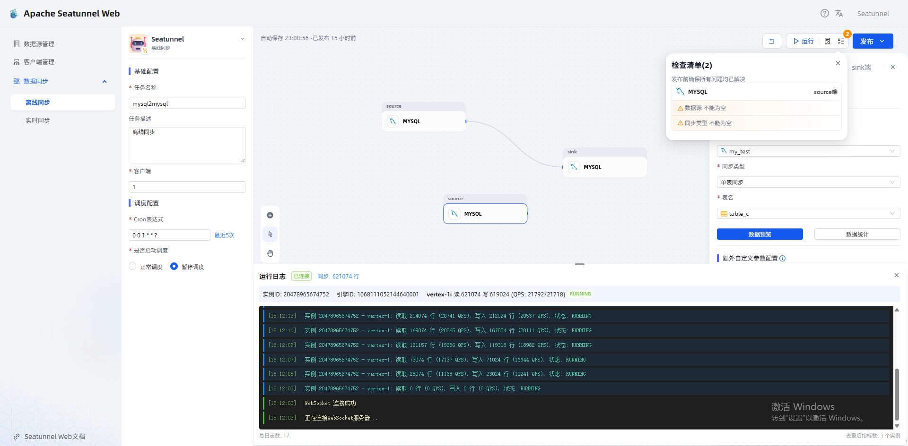
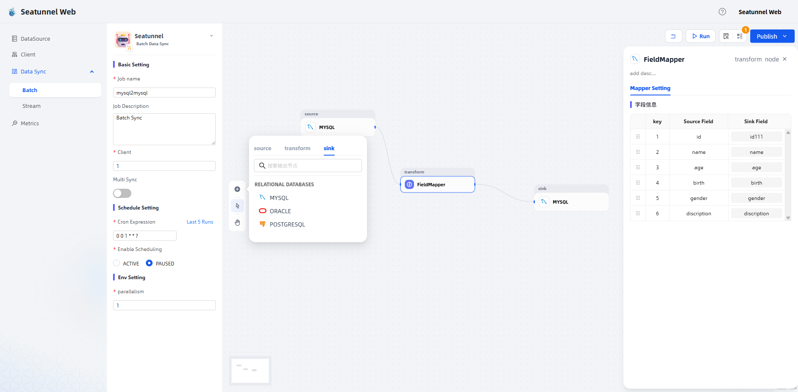
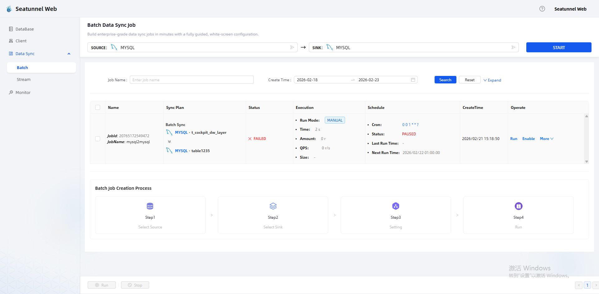
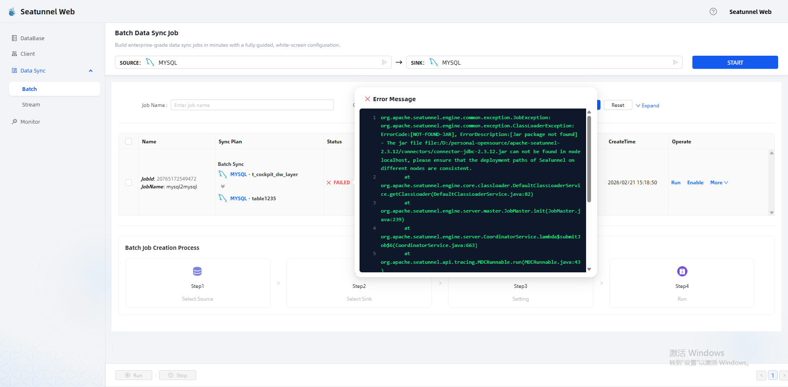
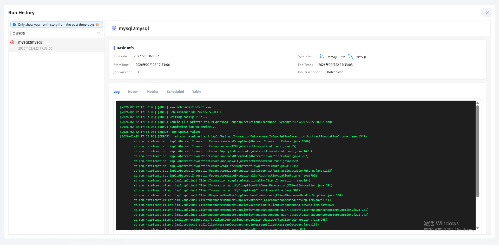
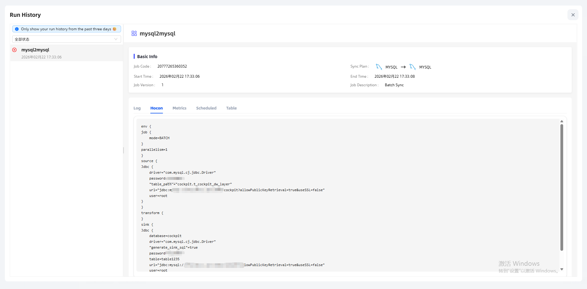
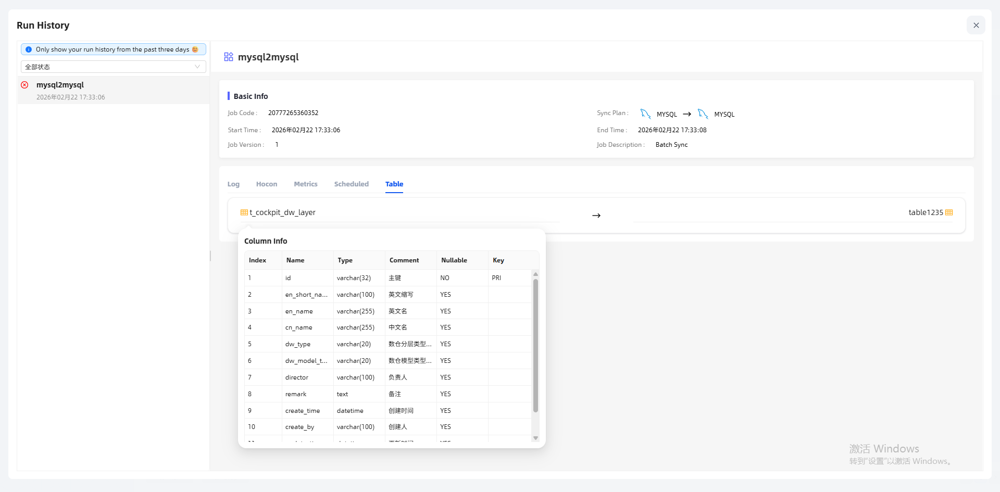
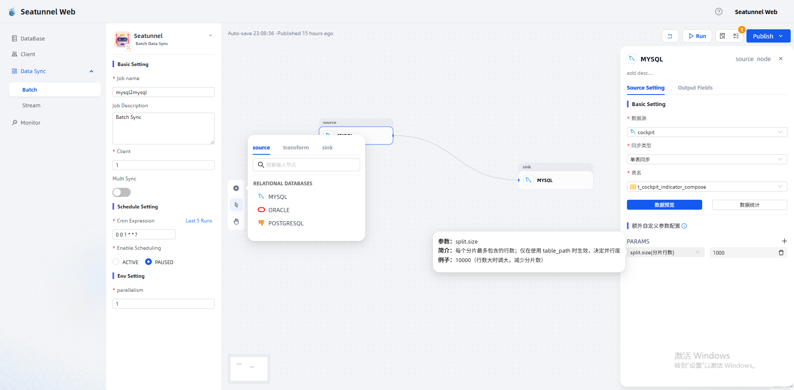
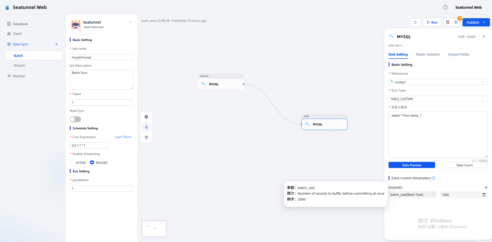
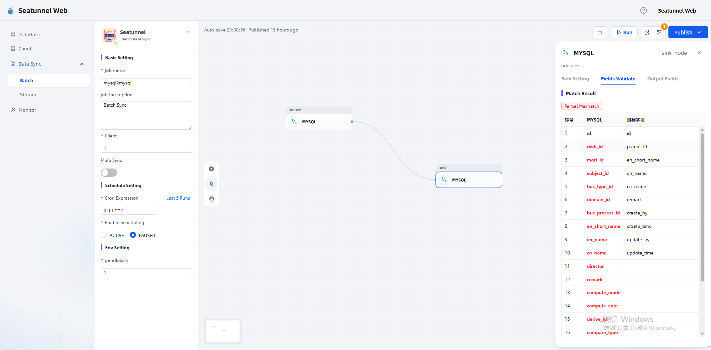

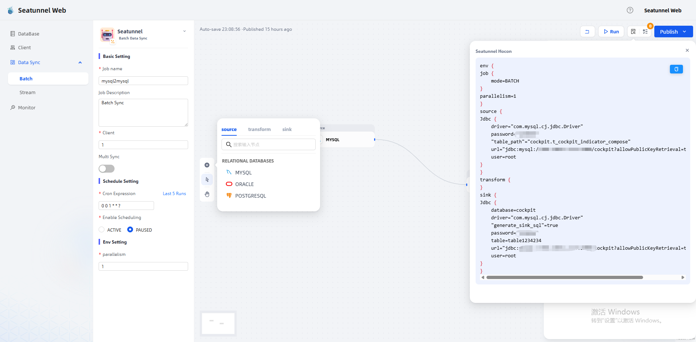
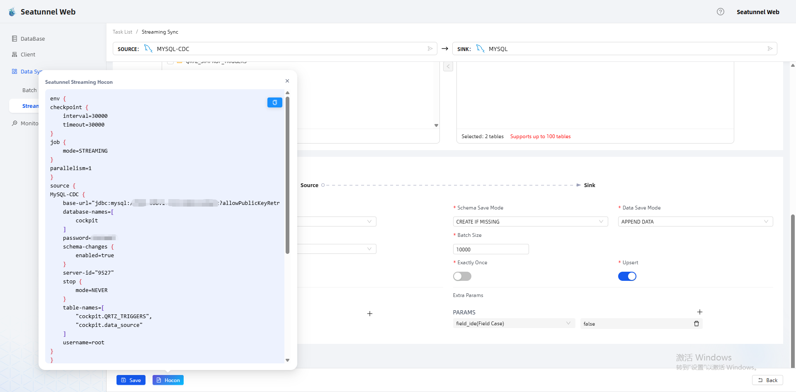
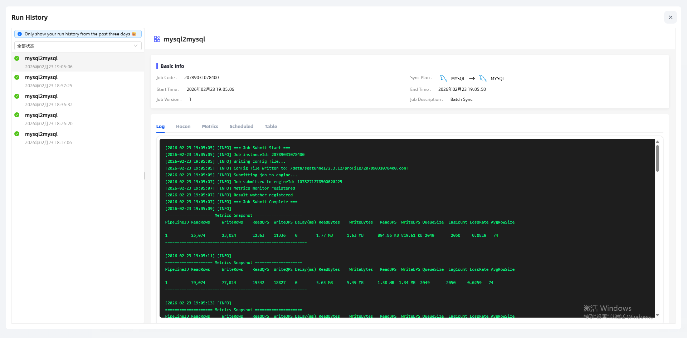
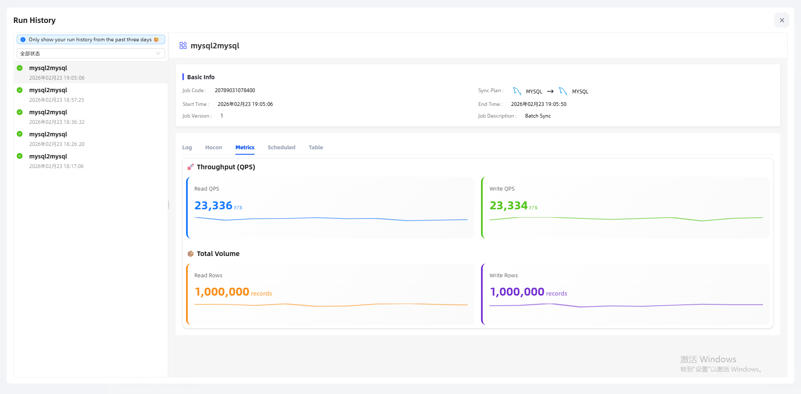

## 🔥 Join Group

If you would like to be among the first to experience the adapted version of SeaTunnel Web,
or join us in building the ecosystem from 0 to 1, you are warmly welcome to join the SeaTunnel Web Early Co-Creation Group.

  

## Github Address
- https://github.com/weifuwan/seatunnel-web

## How to Contribute

We welcome contributions in any form.
